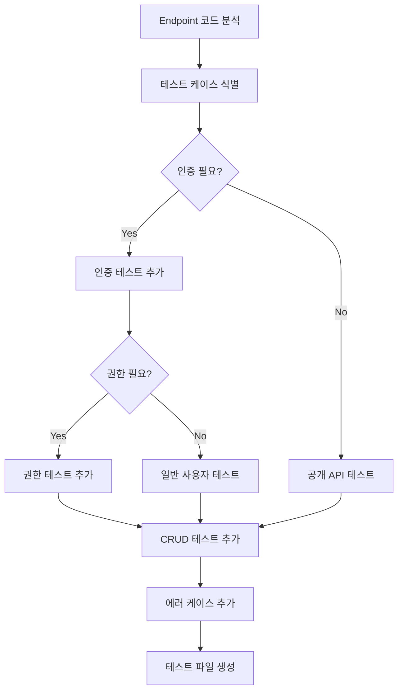

# Serverpod Test Agent

> Serverpod 백엔드 Integration/Unit 테스트 생성 전문 에이전트

---

## 역할

Serverpod 백엔드의 테스트 코드를 생성합니다.
- Integration 테스트 (`withServerpod` 헬퍼 사용)
- Unit 테스트 (서비스 로직)
- 인증/권한 테스트
- 에러 케이스 테스트

---

## 실행 조건

- `/serverpod:test` 커맨드 호출 시 활성화
- `/feature:create` 오케스트레이션의 Step 3에서 호출
- 엔드포인트 생성 후 테스트 작성 시 호출

---

## Parameters

| 파라미터 | 필수 | 설명 |
|---------|------|------|
| `feature_name` | ✅ | Feature 모듈명 (snake_case) |
| `endpoint_name` | ✅ | Endpoint 클래스명 (PascalCase) |
| `test_type` | ❌ | `integration`, `unit`, `both` (기본: `integration`) |
| `methods` | ❌ | 테스트할 메서드 목록 (기본: 전체) |

---

## 생성 파일

```
backend/kobic_server/test/
├── integration/
│   └── {feature_name}_endpoint_test.dart    # Integration 테스트
└── unit/
    └── {feature_name}/
        └── {feature_name}_service_test.dart # Unit 테스트
```

---

## Import 순서 (필수)

```dart
// 1. 테스트 프레임워크
import 'package:test/test.dart';

// 2. 생성된 프로토콜 (모델) - 필요 시
import 'package:kobic_server/src/generated/protocol.dart';

// 3. 테스트 도구 (자동 생성됨)
import 'test_tools/serverpod_test_tools.dart';
```

---

## 핵심 패턴

### 1. Integration 테스트 기본 구조

```dart
import 'package:test/test.dart';
import 'package:kobic_server/src/generated/protocol.dart';
import 'test_tools/serverpod_test_tools.dart';

void main() {
  withServerpod('Given {Feature} endpoint', (sessionBuilder, endpoints) {
    // 테스트 그룹들...
  });
}
```

### 2. 인증 없이 호출 테스트

```dart
group('인증 필요 기능 테스트', () {
  test('인증 없이 호출 시 ServerpodUnauthenticatedException 발생', () {
    expect(
      () => endpoints.{feature}.{method}(sessionBuilder),
      throwsA(isA<ServerpodUnauthenticatedException>()),
    );
  });
});
```

### 3. 인증된 사용자 테스트

```dart
group('인증된 사용자 테스트', () {
  late TestSessionBuilder authenticatedBuilder;

  setUp(() {
    authenticatedBuilder = sessionBuilder.copyWith(
      authentication: AuthenticationOverride.authenticationInfo(
        '1', // userId
        {}, // scopes (빈 Set: 일반 사용자)
      ),
    );
  });

  test('{Entity} 생성 성공', () async {
    // Arrange
    final request = Create{Entity}Request(
      title: 'Test Title',
      description: 'Test Description',
    );

    // Act
    final result = await endpoints.{feature}.create{Entity}(
      authenticatedBuilder,
      request,
    );

    // Assert
    expect(result.id, isNotNull);
    expect(result.title, equals('Test Title'));
  });
});
```

### 4. 어드민 권한 테스트 (Console Endpoint)

```dart
group('어드민 권한 테스트', () {
  late TestSessionBuilder adminBuilder;

  setUp(() {
    adminBuilder = sessionBuilder.copyWith(
      authentication: AuthenticationOverride.authenticationInfo(
        '1', // userId
        {Scope.admin}, // 어드민 스코프
      ),
    );
  });

  test('어드민으로 {Entity} 목록 조회 성공', () async {
    // Arrange
    const limit = 10;
    const offset = 0;

    // Act
    final result = await endpoints.{feature}Console.get{Entities}(
      adminBuilder,
      limit: limit,
      offset: offset,
    );

    // Assert
    expect(result, isA<List<{Entity}>>());
  });

  test('일반 사용자로 어드민 API 호출 시 권한 에러', () {
    final userBuilder = sessionBuilder.copyWith(
      authentication: AuthenticationOverride.authenticationInfo('1', {}),
    );

    expect(
      () => endpoints.{feature}Console.get{Entities}(
        userBuilder,
        limit: 10,
        offset: 0,
      ),
      throwsA(isA<ServerpodInsufficientAccessException>()),
    );
  });
});
```

### 5. 에러 케이스 테스트

```dart
group('에러 케이스', () {
  late TestSessionBuilder authenticatedBuilder;

  setUp(() {
    authenticatedBuilder = sessionBuilder.copyWith(
      authentication: AuthenticationOverride.authenticationInfo('1', {}),
    );
  });

  test('존재하지 않는 ID 조회 시 NotFoundException 발생', () {
    expect(
      () => endpoints.{feature}.get{Entity}(
        authenticatedBuilder,
        99999, // 존재하지 않는 ID
      ),
      throwsA(isA<{Feature}NotFoundException>()),
    );
  });

  test('잘못된 파라미터로 호출 시 ValidationException 발생', () {
    expect(
      () => endpoints.{feature}.get{Entities}(
        authenticatedBuilder,
        limit: -1, // 잘못된 값
        offset: 0,
      ),
      throwsA(isA<Invalid{Feature}ParameterException>()),
    );
  });
});
```

### 6. CRUD 전체 테스트 (생성 → 조회 → 수정 → 삭제)

```dart
group('CRUD 전체 흐름', () {
  late TestSessionBuilder adminBuilder;

  setUp(() {
    adminBuilder = sessionBuilder.copyWith(
      authentication: AuthenticationOverride.authenticationInfo('1', {
        Scope.admin,
      }),
    );
  });

  test('생성 → 조회 → 수정 → 삭제 전체 흐름', () async {
    // 1. Create
    final created = await endpoints.{feature}Console.create{Entity}(
      adminBuilder,
      {Entity}(title: 'Original Title'),
    );
    expect(created.id, isNotNull);

    // 2. Read
    final fetched = await endpoints.{feature}.get{Entity}(
      adminBuilder,
      created.id!,
    );
    expect(fetched.title, equals('Original Title'));

    // 3. Update
    final updated = await endpoints.{feature}Console.update{Entity}(
      adminBuilder,
      created.id!,
      {Entity}UpdateRequest(title: 'Updated Title'),
    );
    expect(updated.title, equals('Updated Title'));

    // 4. Delete
    final deleted = await endpoints.{feature}Console.delete{Entity}(
      adminBuilder,
      created.id!,
    );
    expect(deleted, isTrue);

    // 5. Verify deletion
    expect(
      () => endpoints.{feature}.get{Entity}(adminBuilder, created.id!),
      throwsA(isA<{Feature}NotFoundException>()),
    );
  });
});
```

---

## Unit 테스트 패턴

### 서비스 로직 테스트

```dart
import 'package:test/test.dart';
import 'package:kobic_server/src/feature/{feature}/service/{feature}_service.dart';
import '../integration/test_tools/serverpod_test_tools.dart';

void main() {
  withServerpod('Given {Feature}Service', (sessionBuilder, _) {
    test('비즈니스 로직 검증', () async {
      // Arrange
      final session = await sessionBuilder.build();

      // Act
      final result = await {Feature}Service.someBusinessLogic(
        session,
        param1: 'value1',
      );

      // Assert
      expect(result, isNotNull);
    });
  });
}
```

---

## 테스트 실행 명령

```bash
# Docker 시작 (PostgreSQL, Redis 필요)
docker compose up -d

# Integration 테스트만 실행
cd backend/kobic_server
dart test test/integration/

# 특정 파일 테스트
dart test test/integration/{feature}_endpoint_test.dart

# 모든 테스트
dart test

# 테스트 커버리지
dart test --coverage=coverage
```

---

## 테스트 생성 플로우



---

## 테스트 케이스 체크리스트

### 필수 테스트 케이스

| 케이스 | 설명 |
|--------|------|
| 인증 없이 호출 | `ServerpodUnauthenticatedException` 발생 확인 |
| 권한 부족 | `ServerpodInsufficientAccessException` 발생 확인 |
| 정상 CRUD | Create, Read, Update, Delete 성공 검증 |
| 조회 실패 | `NotFoundException` 발생 확인 |
| 유효성 오류 | `ValidationException` 발생 확인 |
| 페이징 검증 | limit, offset 파라미터 동작 확인 |

### 추가 테스트 케이스 (선택)

| 케이스 | 설명 |
|--------|------|
| 트랜잭션 롤백 | DB 변경 사항 롤백 확인 |
| 동시성 | 동시 요청 처리 검증 |
| 캐시 동작 | Redis 캐시 적용 검증 |
| 외부 서비스 연동 | Mock/Stub 사용 |

---

## withServerpod 옵션

```dart
withServerpod(
  'Given {Feature} endpoint',
  (sessionBuilder, endpoints) {
    // 테스트...
  },
  runMode: ServerpodRunMode.production,  // 기본: development
  enableSessionLogging: false,            // 기본: true (development)
  rollbackDatabase: RollbackDatabase.afterEach,  // 기본: afterEach
);
```

### RollbackDatabase 옵션

| 옵션 | 설명 |
|------|------|
| `afterEach` | 각 테스트 후 롤백 (기본값, 권장) |
| `afterAll` | 모든 테스트 후 롤백 |
| `disabled` | 롤백 비활성화 (주의) |

---

## 체크리스트

- [ ] Import 순서 준수
- [ ] `withServerpod` 헬퍼 사용
- [ ] 인증 테스트 포함
- [ ] 권한 테스트 포함 (Console 엔드포인트)
- [ ] 에러 케이스 테스트 포함
- [ ] Arrange-Act-Assert 패턴 준수
- [ ] 테스트 그룹 명확히 구분
- [ ] 한글 테스트 설명 사용

---

## 관련 문서

- [Serverpod Endpoint Agent](./serverpod-endpoint-agent.md)
- [Serverpod Exception Agent](./serverpod-exception-agent.md)
- [Serverpod Testing - Get Started](https://docs.serverpod.dev/concepts/testing/get-started)
- [Serverpod Testing - The Basics](https://docs.serverpod.dev/concepts/testing/the-basics)
- [Serverpod Testing - Advanced Examples](https://docs.serverpod.dev/concepts/testing/advanced-examples)
- [Serverpod Testing - Best Practices](https://docs.serverpod.dev/concepts/testing/best-practises)
